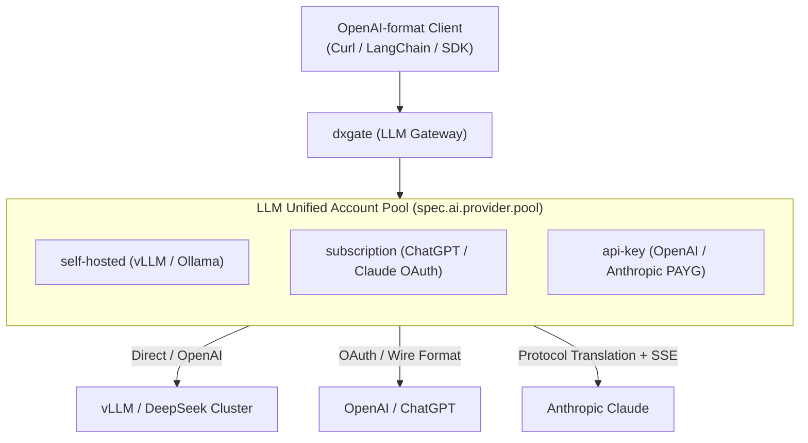

# LLM Services

Clients can always use the standard OpenAI format. dxgate integrates a **full-duplex multi-protocol translation engine** and an **Account Pool** within the LLM module (`spec.ai`), orchestrating self-hosted private compute, monthly subscriptions, and pay-as-you-go APIs.



---

## 1. Three Account Pool Types

The LLM module natively federates compute from diverse sources behind a single endpoint:

| Account Type (`type`) | Authentication | Cost & Billing | Operational Characteristics |
| :--- | :--- | :--- | :--- |
| **`self-hosted`** | Endpoint URL + optional Token | **$0 Marginal Cost** (Monitors GPU concurrency & queue) | In-cluster vLLM, SGLang, Ollama, etc.; supports `maxConcurrency` limits. |
| **`subscription`** | OAuth Refresh Token Secret | **Fixed Monthly** (Tracks ChatGPT/Claude Credits) | Team ChatGPT Plus/Pro (Codex), Claude Code accounts; background auto-refresh. |
| **`api-key`** | API Key Secret (`Bearer` / `x-api-key`) | **Pay-per-Token** (Real-time USD ledger) | Official OpenAI, Anthropic, DeepSeek Keys; supports RPM/TPM throttling. |

---

## 2. Scheduling and Fault Tolerance

The gateway **never imposes hardcoded default priorities**. All routing behaviors are user-declared:

### Mode A: Default Flat Scheduling (Flat Weighted Round-Robin)
When `priority` is omitted, all accounts operate as equals. Traffic is distributed according to `weight`. When any node encounters `429` (Rate Limit) or `503` (Queue Full), the gateway performs millisecond-level failover to another healthy node.

### Mode B: User-Defined Priority
**Only when the user explicitly sets `priority`** (lower numbers take precedence, e.g., `priority: 1` before `priority: 2`), the gateway routes in strict numerical order:
- Requests fill `priority: 1` accounts first;
- When all `priority: 1` accounts enter cooldown, traffic gracefully overflows to `priority: 2` accounts, preventing client-visible 429s.

### Session Affinity & Prompt Caching
- Enabling `sessionAffinity: true` pins requests to a specific account using headers (e.g. `x-session-id`) or conversation context, **maximizing upstream Prompt Caching hits** to slash latency and token costs by up to 90%.

---

## 3. DxgateService Configuration

```yaml
apiVersion: networking.dubbo.apache.org/v1alpha3
kind: DxgateService
metadata:
  name: llm-gateway
  namespace: dubbo-system
spec:
  ai:
    provider:
      openai:
        # LLM unified account pool definition
        pool:
          # --- Self-hosted compute ---
          - id: vllm-deepseek-r1
            type: self-hosted
            weight: 100
            endpoint: http://vllm-cluster.ai-infra.svc:8000/v1
            maxConcurrency: 64

          # --- Subscription account (Auto OAuth refresh) ---
          - id: codex-team-01
            type: subscription
            weight: 100
            credentialRef:
              name: oauth-codex-01
              key: token.json

          # --- Official API Key fallback ---
          - id: openai-official-key
            type: api-key
            weight: 50
            credentialRef:
              name: openai-secret
              key: token

        models: [gpt-5, claude-sonnet-4, deepseek-r1]
        routes:
          /v1/chat/completions: COMPLETIONS
          /v1/responses: RESPONSES

  policies:
    scheduling:
      sessionAffinity: true             # Maximize Prompt Cache hits
    cooldown:
      onRateLimit: 300s                 # Auto-cooldown 5m on 429
      onQueueFull: 30s                  # Cooldown 30s on self-hosted queue saturation
      autoRefreshOAuth: true            # Background auto-refresh for OAuth tokens
    timeout: 60s
    retry:
      attempts: 2
      statusCodes: [502, 503, 504]
```

---

## 4. HTTPRoute Binding

Expose LLM services using standard Kubernetes Gateway API `HTTPRoute`:

```yaml
apiVersion: gateway.networking.k8s.io/v1
kind: HTTPRoute
metadata:
  name: llm-route
  namespace: dubbo-system
spec:
  parentRefs:
    - name: dxgate-proxy
  rules:
    - matches:
        - path:
            type: PathPrefix
            value: /v1
      backendRefs:
        - name: llm-gateway
          group: networking.dubbo.apache.org
          kind: DxgateService
```

---

## 5. Web UI 【LLM Services】 Console Specification

Adhering to the **Porcelain Blueprint** and industrial-grade dashboard aesthetic, the LLM module in `/ui` provides a live monitoring console:

```
+---------------------------------------------------------------------------------------------------------------------+
|  dxgate Web UI  >  LLM Services  >  llm-gateway                                                        [ v0.5.0-p1 ] |
+---------------------------------------------------------------------------------------------------------------------+
|  [ Overview ]   [ Credentials Pool (3) ]   [ Scheduling Policies ]   [ Cost & Usage Ledger ]                        |
+---------------------------------------------------------------------------------------------------------------------+

  Self-Hosted Compute Pool
  -------------------------------------------------------------------------------------------------------------------
  Instance ID         Endpoint / Host               Status        Concurrency   P95 Latency   Prompt Cache Rate  Action
  -------------------------------------------------------------------------------------------------------------------
  vllm-deepseek-r1    http://vllm-cluster:8000/v1   Ready      42 / 64       38 ms         78.4%              [Probe] [Drain]

  Subscription Pool (OAuth Managed)
  -------------------------------------------------------------------------------------------------------------------
  Account ID          Provider    Status            Usage (Credits)  Cooldown Remaining     OAuth Token Health Action
  -------------------------------------------------------------------------------------------------------------------
  codex-team-01       ChatGPT     Active         4,120 credits    --                     Valid (Expires in 27d) [Test] [Pause]
  codex-team-02       ChatGPT     Cooling (429)  6,850 credits    03m:18s             Valid (Expires in 19d) [Reset] [Test]

  Cloud API Key Pool (PAYG)
  -------------------------------------------------------------------------------------------------------------------
  Account ID          Provider    Status            Cost (USD)       Limits (RPM / TPM)     Active Leases      Action
  -------------------------------------------------------------------------------------------------------------------
  openai-official-key OpenAI      Standby        $ 18.45          3,000 / 250,000        0 connections      [Edit] [Test]

  Today's Throughput: Self-Hosted 68.2% | Subscriptions 29.5% | Elastic API 2.3% (Saved ~$2,140 USD for team)
+---------------------------------------------------------------------------------------------------------------------+
```
