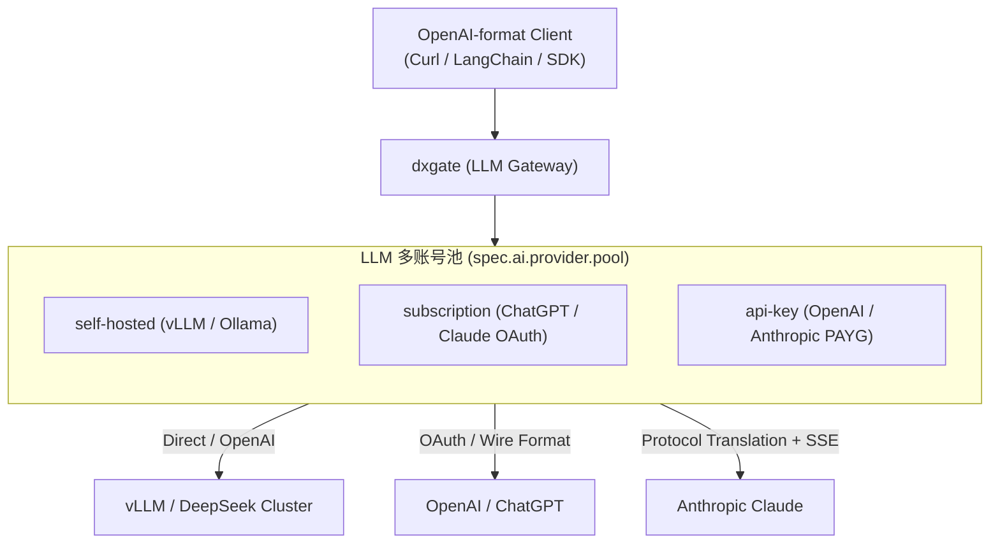

# LLM Service

客户端始终可以使用 OpenAI 格式接入。dxgate 在 LLM 模块（`spec.ai`）内集成了**多协议全双工转换引擎**与**多账号资源池（Account Pool）**，统一调度自建私有算力、包月订阅与云端按量 API。



---

## 1. LLM 三大账号池类型

LLM 模块原生支持将不同来源的算力汇聚在同一个网关端点：

| 账号类型 (`type`) | 认证机制 | 成本与计费 | 运行特性 |
| :--- | :--- | :--- | :--- |
| **`self-hosted`** | Endpoint URL + 可选 Token | **0 边际成本** (统计 GPU 并发与队列) | 内网私有化 vLLM、SGLang、Ollama 等集群；支持 `maxConcurrency` 并发阈值保护。 |
| **`subscription`** | OAuth Refresh Token Secret | **固定包月** (统计 ChatGPT/Claude Credits) | 团队采购的 ChatGPT Plus/Pro (Codex)、Claude Code 账号；后台协程自动续约 Token。 |
| **`api-key`** | API Key Secret (`Bearer` / `x-api-key`) | **按 Token 消耗美元** (实时 USD 账本) | OpenAI、Anthropic、DeepSeek 官方 Key；支持 RPM/TPM 限额保护。 |

---

## 2. 调度与容灾策略

网关**不预设任何强制性的硬编码优先级**，一切调度行为由用户声明决定：

### 模式 A：默认平权调度（Flat Weighted Round-Robin）
若用户**未配置** `priority` 参数，所有配置的账号处于平等地位，网关按 `weight` 比例平权轮询分发流量。任意账号遇到 `429`（限流）或 `503`（队列满）时，自动触发毫秒级故障转移（Failover），平滑切至池内其他健康节点。

### 模式 B：用户自定义优先级（User-Defined Priority）
**仅当用户显式指定** `priority` 参数（数字越小越优先，如 `priority: 1` 优先于 `priority: 2`）时，网关严格按用户定义的优先级顺序进行主备/分层溢出调度：
- 优先将请求打满 `priority: 1` 账号池；
- 当 `priority: 1` 账号全部因频次超限进入冷却时，**无感溢出**至 `priority: 2` 账号，确保业务不报 429。

### 会话粘滞与 Prompt Cache 锁定
- 开启 `sessionAffinity: true` 时，网关依据客户端会话头（如 `x-session-id`）或对话上下文将请求锁定在特定账号上，**吃满上游大模型的 Prompt Caching（前缀提示词缓存）**，可降低最高 90% 的延迟与 Token 开销。

---

## 3. DxgateService 配置示例

```yaml
apiVersion: networking.dubbo.apache.org/v1alpha3
kind: DxgateService
metadata:
  name: llm-gateway
  namespace: dubbo-system
spec:
  ai:
    provider:
      openai:
        # LLM 统一账号池定义
        pool:
          # --- 自建算力 ---
          - id: vllm-deepseek-r1
            type: self-hosted
            weight: 100
            endpoint: http://vllm-cluster.ai-infra.svc:8000/v1
            maxConcurrency: 64

          # --- 订阅账号 (自动续约) ---
          - id: codex-team-01
            type: subscription
            weight: 100
            credentialRef:
              name: oauth-codex-01
              key: token.json

          # --- 官方 API Key 兜底 ---
          - id: openai-official-key
            type: api-key
            weight: 50
            credentialRef:
              name: openai-secret
              key: token

        models: [gpt-5, claude-sonnet-4, deepseek-r1]
        routes:
          /v1/chat/completions: COMPLETIONS
          /v1/responses: RESPONSES

  policies:
    scheduling:
      sessionAffinity: true             # 开启会话粘滞 (Prompt Cache 优先)
    cooldown:
      onRateLimit: 300s                 # 遇到 429 自动冷却 5 分钟
      onQueueFull: 30s                  # 自建节点队列满冷却 30 秒
      autoRefreshOAuth: true            # 自动续期订阅 OAuth Token
    timeout: 60s
    retry:
      attempts: 2
      statusCodes: [502, 503, 504]
```

---

## 4. HTTPRoute 路由绑定

使用标准 Kubernetes Gateway API `HTTPRoute` 将外网流量引入 LLM 网关：

```yaml
apiVersion: gateway.networking.k8s.io/v1
kind: HTTPRoute
metadata:
  name: llm-route
  namespace: dubbo-system
spec:
  parentRefs:
    - name: dxgate-proxy
  rules:
    - matches:
        - path:
            type: PathPrefix
            value: /v1
      backendRefs:
        - name: llm-gateway
          group: networking.dubbo.apache.org
          kind: DxgateService
```

---

## 5. Web UI 【LLM Services】 控制台设计规范

遵循 **瓷蓝蓝图（Porcelain Blueprint）** 与现代工业级控制台设计美学，LLM 模块在 `/ui` 中提供了极具质感的实时监控看板：

```
+---------------------------------------------------------------------------------------------------------------------+
|  dxgate Web UI  >  LLM Services  >  llm-gateway                                                        [ v0.5.0-p1 ] |
+---------------------------------------------------------------------------------------------------------------------+
|  [ 概览 Overview ]   [ 账号池 Credentials Pool (3) ]   [ 调度策略 Policies ]   [ 成本与账本 Cost Control ]          |
+---------------------------------------------------------------------------------------------------------------------+

  自建算力池 (Self-Hosted Compute)
  -------------------------------------------------------------------------------------------------------------------
  Instance ID         Endpoint / Host               Status        Concurrency   P95 Latency   Prompt Cache Rate  Action
  -------------------------------------------------------------------------------------------------------------------
  vllm-deepseek-r1    http://vllm-cluster:8000/v1   Ready      42 / 64       38 ms         78.4%              [探测] [下线]

  订阅型账号池 (Subscriptions - OAuth Managed)
  -------------------------------------------------------------------------------------------------------------------
  Account ID          Provider    Status            Usage (Credits)  Cooldown Remaining     OAuth Token Health Action
  -------------------------------------------------------------------------------------------------------------------
  codex-team-01       ChatGPT     Active         4,120 credits    --                     Valid (Expires in 27d) [测试] [暂停]
  codex-team-02       ChatGPT     Cooling (429)  6,850 credits    03m:18s             Valid (Expires in 19d) [重置] [测试]

  云端 API 按量型账号池 (API-Key / PAYG)
  -------------------------------------------------------------------------------------------------------------------
  Account ID          Provider    Status            Cost (USD)       Limits (RPM / TPM)     Active Leases      Action
  -------------------------------------------------------------------------------------------------------------------
  openai-official-key OpenAI      Standby        $ 18.45          3,000 / 250,000        0 connections      [编辑] [测试]

  今日吞吐汇总：自建算力承担 68.2% | 订阅账号承担 29.5% | 弹性 API 兜底 2.3% （预估为团队节省成本 $2,140 USD）
+---------------------------------------------------------------------------------------------------------------------+
```

### UI 设计核心亮点：
1. **即时状态微徽章（Micro-Status Badges）**：
   - `Ready / Active`：健康监听中。
   - `Cooling`：展示动态退避倒计时（例如 `03m:18s`），倒计时归零后自动恢复可用。
   - `OAuth Valid`：展示 Token 剩余有效期及自动刷新协程状态。
2. **三轨并行业务账本**：
   - 独立追踪 GPU 算力并发利用率、ChatGPT 订阅 Credits 消耗、官方 API 美元账本，数据互不混淆。
3. **极简操作交互**：
   - 支持在 UI 上一键对特定账号发起 `[健康探测]`、`[强制冷却]` 或 `[手动下线]`。
